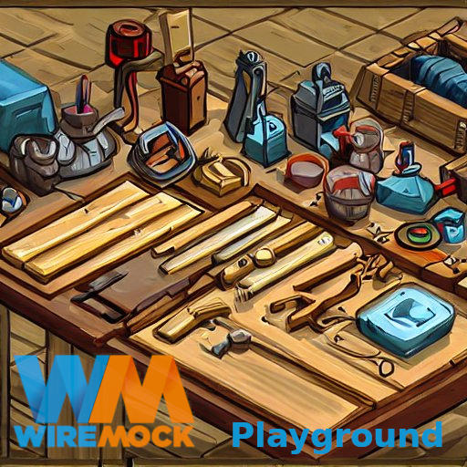

# wiremock-playground

A playground for wiremock exploration.

[](https://github.com/ckroeger/wiremock-playground)

## Start Wiremock via Docker
```shell
docker run -it --rm \
  -v $(pwd)/wiremock:/home/wiremock:rw \
  -p 8443:8443 -p 8080:8080 \
  --name wiremock \
  wiremock/wiremock:3.3.1 \
  --https-port 8443 --verbose
```
## Test if container is up
```shell
curl -w "\n" -k -X GET https://localhost:8443/status
UP
```

## Links
* [WireMock at Github](https://github.com/wiremock)
* [WireMock - flexible, open source API mocking | WireMock](https://wiremock.org/)
* [WireMock User Documentation | WireMock](https://wiremock.org/docs/)
  * [How to Download and Install WireMock](https://wiremock.org/docs/download-and-installation/)
